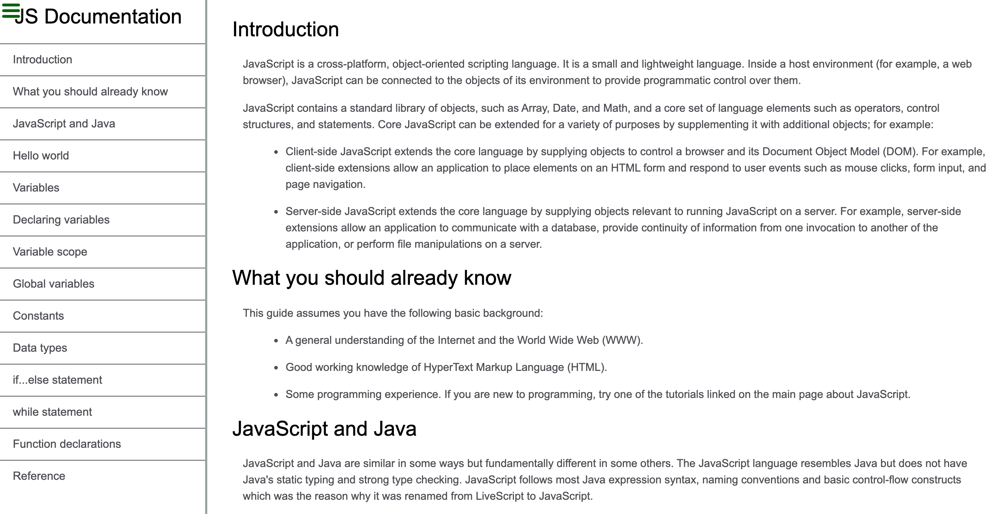
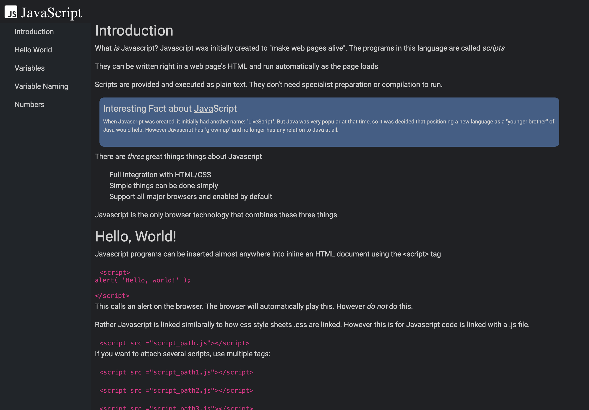

Technical Document

This is from a challenge from Free Code Camp. The challenge is to create a technical document similar to <a href="https://codepen.io/freeCodeCamp/full/NdrKKL">this </a>

I decided to challenge myself and use bootstrap along with CSS.

I found that working with bootstrap, I preferred vanilla CSS. Bootstrap has great out of the box tricks, and is a valuable tool. But I found it much faster to align items using CSS flexbox.

This is a technical document to inform the user about Javascript.

Technologies used are

- HTML
- CSS
- Bootstrap
  Technical documentation were sourced from 

  <a href="https://javascript.info">Javascript.info</a> 

  <a href="https://www.theodinproject.com/lessons/fundamentals-part-1">The Odin Project</a> 

  <a href="https://www.w3schools.com/js/js_numbers.asp">W3 Schools</a> 

